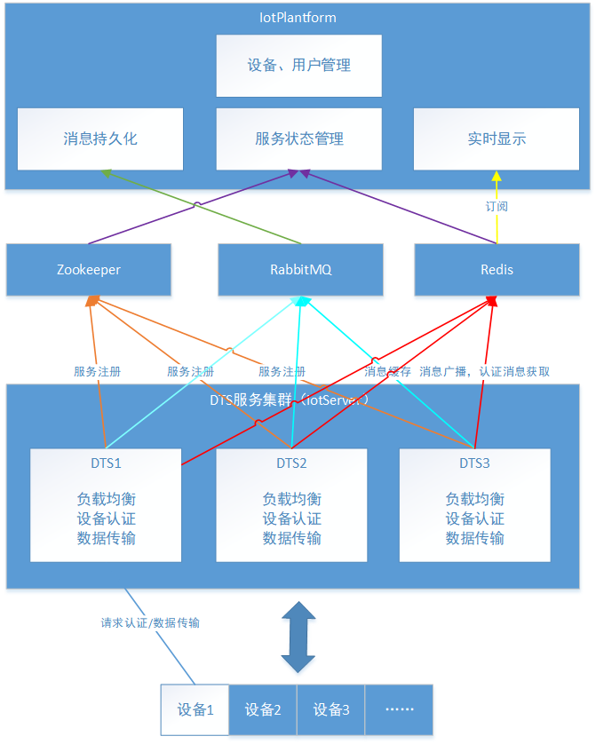

# iotPlantform
### 技术栈：
- springboot
- mybatis、mybatisPlus
- rabbitmq
- redis
- mysql
### 主要实现功能
- 设备管理，注册认证生成访问密钥，删除设备认证，并把设备的密钥同步到reis，提供给iotServer服务使用
- 用户管理
- 从rabbitmq队列中消费设备消息记录，并把记录持久化到本地mysql数据库
- 订阅redis话题，实现实时获取设备的广播信息

### 系统框架图

