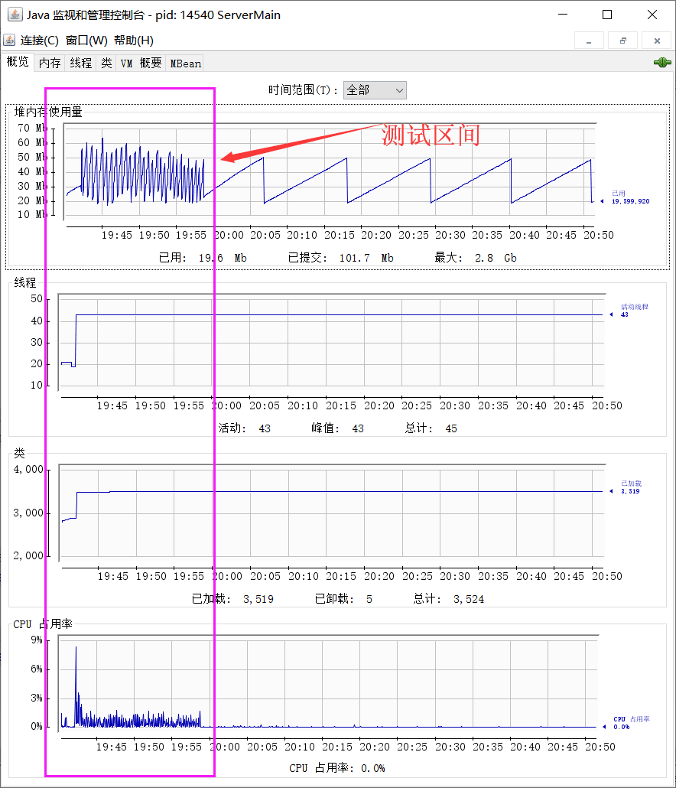

# iotPlantform
### 技术栈：
- springboot
- mybatis、mybatisPlus
- rabbitmq
- redis
- mysql
### 主要实现功能
- 设备管理，注册认证生成访问密钥，删除设备认证，并把设备的密钥同步到reis，提供给iotServer服务使用
- 用户管理
- 从rabbitmq队列中消费设备消息记录，并把记录持久化到本地mysql数据库
- 订阅redis话题，实现实时获取设备的广播信息
- DTS服务状态监测

### 系统框架图

# 单机单节点压力测试效果
### 节点配置
名称|属性|备注
---|---|---
服务器os|win10 amd64|idea运行
虚拟机|Java HotSpot(TM) 64-Bit Server VM版本 25.121-b13||
JIT|HotSpot 64-Bit Tiered Compilers|
总编译时间|15.654 秒|
总物理内存|12,453,172 KB|
内网带宽|150M|实际没那么大
服务器网卡|Qualcomm Atheros QCA9377 Wireless Network Adapter

[点击查看平台压力测试详情(加载可能很慢)](http://htmlpreview.github.io/?https://github.com/dyingstraw/iotServer/blob/master/img/mytest/index.html)

